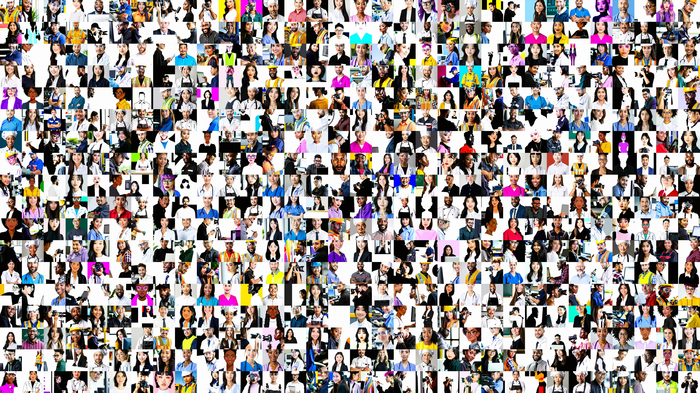

# Ethics Diffusion

This repository contains the source code, data, and analysis for the research paper `Seeing Bias: Demographic 
Representation of Professions in Image-Generation Systems` which was the final product of the seminar **Ethics
and Epistemology of AI**, which was conducted as a cooperation between the Otto-Friedrich-University of Bamberg,
the Technical University Berlin, and the Berlin Ethics Lab.



## Abstract
_This paper investigates demographic bias in the text-to-image model Stable Diffusion 3.5, focusing on the 
representation of professions. By systematically varying prompt-specificity with respect to demographic 
attributes (gender, ethnicity, profession), we analyze the model's outputs and compare them with real-world 
labor statistics. Our findings show that the model overrepresents white individuals and defaults to gender 
stereotypes, portraying men in technical roles and women in caregiving positions. Increasing prompt 
specificity does not mitigate these biases and, in some cases, amplifies or hides them through 
"stereotype stacking". These results show that the model does not mirror reality but instead reinforces 
and magnifies existing societal biases, raising critical ethical concerns about representational harm, 
symbolic erasure, and the perpetuation of inequality through GenAI._

**Read the full paper [here](assets/paper.pdf).**

## 🔑 Key Findings
Our analysis demonstrates that Stable Diffusion 3.5:

* 🧑‍💻 **Defaults to Stereotypes:** When given neutral prompts (e.g., "a photo of an engineer"), the model defaults to 
generating images of white men, reinforcing a narrow, stereotypical view of the profession.
* 🔥 **Amplifies Existing Biases:** The model doesn't just reflect real-world demographic distributions; 
it often exaggerates them. For example, female-majority professions were depicted with an almost exclusively 
female representation (95%), far exceeding real-world figures.
* 📉 **Fails at Intersectionality:** Prompts for intersectional identities (e.g., "Black female engineer") often 
resulted in lower-quality images, visual distortions, or complete erasure, suggesting the model struggles to 
represent identities that deviate from its trained defaults.
* 🎭 **Performs "Stereotype Stacking":** Increasing prompt specificity by adding demographic markers did not 
consistently reduce bias. Instead, it sometimes layered stereotypes, creating an illusory improvement while 
leaving systemic issues unaddressed.
* 🌐 **Exhibits Strong "White Normativity":** Across nearly all professions, the model showed a strong tendency 
to generate white-presenting individuals unless another ethnicity was explicitly requested.

## 📊 Data
You can access all results via this [Google Drive](https://drive.google.com/drive/folders/1tZUvYm-MlYgFQ-REH_i9Qv0Pgx6VQmuv?usp=drive_link).

## 🌳 Repository Structure
```
.
├── 📄 README.md            
├── 📜 LICENSE              
├── 📋 requirements.txt
├── run.py     
|
├── 📂 assets/
│   ├── prompts.csv         
│   └── imgs/     
|
├── 📂 src/
|   ├── visualize.csv 
│   └── sd_pipe.py  
|
└── 📂 analysis/
    ├── prompt-specificity/ 
    ├── self-analysis/ 
    └── survey/

```
## ⚙️ Settings

* You need a HuggingFace access token. See how you can generate it [here](https://huggingface.co/docs/hub/security-tokens).
* Create an `.env` file and save the token there. If you name it other than `HF_KEY`, you need to modify the code accordingly.
* The configuration for the model is set in `SDConfig`. 
* We use the `stabilityai/stable-diffusion-3.5-large-turbo` model by default. Be aware that you need to get access to the models first (https://huggingface.co/stabilityai)
* Generated images and prompts are saved in the `./images` directory by default. 

## 🏃🏽‍♂️ Quickstart

#### Clone the repository
```
git clone https://github.com/VoErik/sd-3-ethics.git
cd sd-3-ethics
```
#### Create and activate a virtual environment
```
python -m venv venv
source venv/bin/activate  # On Windows, use `venv\Scripts\activate`
```
#### Install the required dependencies
```
pip install -r requirements.txt
```
#### And run it!
```
python run.py --task=g \
              --num_imgs=10 \
              --width=512 \
              --height=512 \
              --model="turbo-3.5" \
              --steps=50 \
              --guidance=7.0
```
